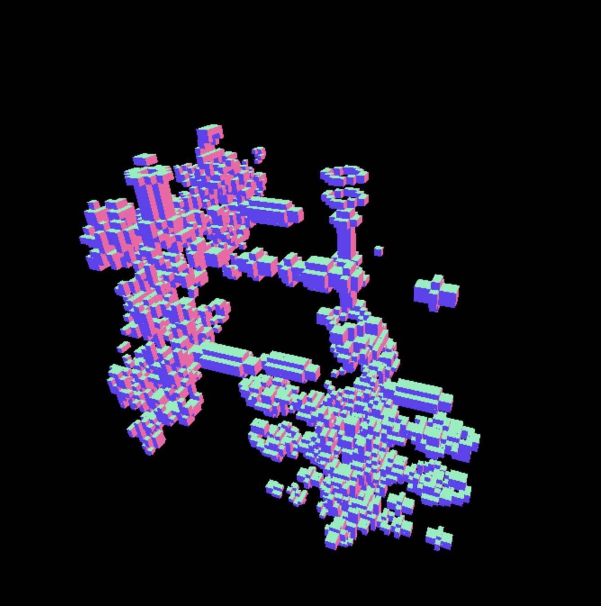

# 3D Cellular Automata

A crap attempt at 3D cellular automata. While it looks surprisingly interesting, I can't actually confirm if it works or not because most of the rules I tried give [completely different results](https://softologyblog.wordpress.com/2019/12/28/3d-cellular-automata-3/). Either way, it was a fun experiment.
